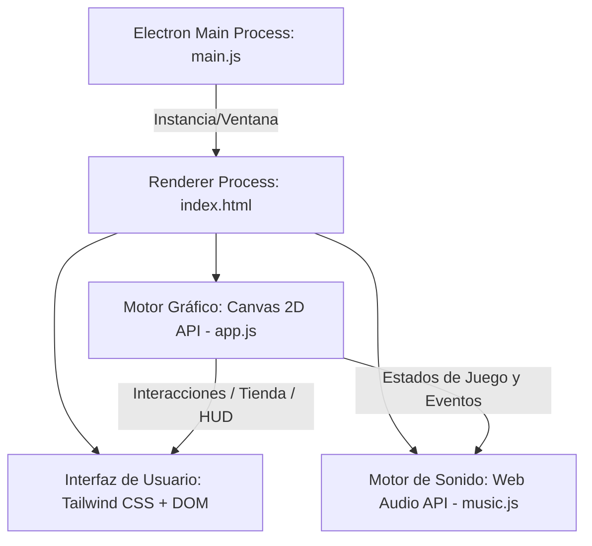

# Documentación Técnica: RanaMinas: El Templo Perdido

**Asignatura:** Desarrollo de Videojuegos / Ingeniería de Software  
**Proyecto:** RanaMinas: El Templo Perdido  
**Plataforma:** Aplicación de Escritorio (Windows x64)  
**Tecnologías Clave:** HTML5 Canvas, Tailwind CSS, Web Audio API, JavaScript ES6, Electron.

---

## 1. Introducción y Resumen del Proyecto

**RanaMinas: El Templo Perdido** es un videojuego híbrido que fusiona la mecánica clásica de lógica de *Buscaminas* (Minesweeper) con elementos de *RPG de exploración, economía interna (tienda de mejoras)* y *combates contra Jefes (Bosses)* en tiempo real. 

El juego se divide en **6 biomas temáticos** (Pantano, Bosque, Desierto, Ciudad, Nieve y Montaña), cada uno compuesto por 5 niveles de dificultad progresiva. El quinto nivel de cada bioma introduce un combate contra un jefe único con mecánicas de proyectiles en tiempo real.

El proyecto está diseñado bajo un enfoque de **cero dependencias externas de runtime para la ejecución del motor**, utilizando APIs nativas del navegador para el renderizado (HTML5 Canvas) y el audio (Web Audio API). El empaquetamiento y distribución se realizan sobre **Electron**, convirtiendo la aplicación web en un ejecutable de escritorio nativo de alto rendimiento.

---

## 2. Arquitectura de Software

El videojuego implementa una arquitectura híbrida adaptada a aplicaciones web modernas de alto rendimiento:



### Componentes Clave:
1. **Capa de Presentación (DOM / Tailwind CSS):** Encargada de renderizar la HUD flotante (vida, monedas, nivel, escudo), el menú principal, las pantallas de transición entre biomas y la interfaz de la tienda de templos.
2. **Capa de Simulación y Gráficos (Canvas 2D - `app.js`):** Un bucle de juego continuo (*Game Loop*) basado en `requestAnimationFrame` que procesa la física de partículas, renderiza la cuadrícula de celdas del Buscaminas, gestiona los efectos visuales (Parallax, sacudida de pantalla, animaciones de la rana) y simula los proyectiles de los jefes en tiempo real.
3. **Capa de Audio Procedural (`music.js` + `AudioSynth`):** Motor de síntesis aditiva y sustractiva en tiempo real que autogenera la música de fondo y los efectos de sonido sin cargar archivos `.mp3` o `.wav` externos, reduciendo el tamaño del binario a mínimos absolutos.

---

## 3. Implementación Tecnológica y Detalle de Código

### A. Frontend y Renderizado (HTML5 Canvas & Tailwind CSS)
* **HTML5 Canvas:** Se utiliza para dibujar la cuadrícula del mapa, los sprites vectoriales y de partículas, los proyectiles, el personaje y los fondos dinámicos. Evita el cuello de botella del DOM al realizar operaciones directas sobre el búfer gráfico a 60 FPS.
* **Física y Partículas:** `app.js` gestiona un array de partículas físicas con gravedad, velocidad angular y atenuación de color para las explosiones, recolección de monedas y daño recibido.
* **Efecto Parallax:** Se renderizan múltiples capas de fondo que se desplazan a diferentes velocidades relativas al movimiento de la cámara, simulando profundidad tridimensional en un entorno 2D.
* **Tailwind CSS:** Se integra mediante CDN para estructurar la HUD, la tienda de mejoras y los modales interactivos con diseño responsivo, glassmorphism (`backdrop-blur`) y animaciones fluidas de hover.

---

## B. Lógica del Juego (JavaScript ES6)
La lógica principal del juego se ejecuta en `app.js`. Sus algoritmos críticos incluyen:
* **Algoritmo de Flood Fill (Revelado en Cascada):** Cuando se hace clic en una casilla vacía (0 minas adyacentes), se ejecuta una función recursiva que revela todas las casillas adyacentes seguras de forma instantánea.
* **Generación Diferida y Radio de Seguridad:** Las minas no se posicionan al cargar el tablero, sino tras el *primer clic* del jugador. El algoritmo calcula la distancia Chebyshev desde el primer clic y solo posiciona minas a una distancia mayor a 1, garantizando que el inicio de la partida sea siempre 100% seguro.
* **Lógica del Combate contra Jefes:** Durante el nivel 5 de cada bioma, se activa un ciclo de ataque periódico (`bossAttackInterval`). El jefe dispara proyectiles que se desplazan hacia el jugador usando vectores de velocidad normalizados, obligando al jugador a alternar entre resolver el tablero y esquivar activamente en tiempo real.

---

## C. Motor de Audio Procedural (Web Audio API)
En lugar de reproducir archivos de sonido tradicionales, el juego **sintetiza el audio dinámicamente** mediante ondas puras creadas por el procesador del cliente a través del chip de audio.

#### 1. Síntesis de Percusión (Drums)
* **Kick (Bombo):** Se genera mediante un oscilador de tipo `triangle` que inicia en 130-150Hz y realiza un barrido exponencial rápido (`exponentialRampToValueAtTime`) hacia 0.01Hz en 0.11 segundos, emulando la física de un parche de bombo real.
* **Snare (Caja):** Se crea un buffer de ruido blanco aleatorio con `Math.random()`, el cual se filtra mediante un nodo `BiquadFilterNode` configurado en `bandpass` (~1000Hz) y se atenúa rápidamente con una curva de volumen exponencial de caída rápida.
* **Hi-hat (Platillo):** Ruido blanco filtrado con un filtro de paso alto (`highpass` a ~9000Hz) con una duración extremadamente corta (0.03s).

#### 2. Sintetizadores de Instrumentos
* **Bajo (Bassline):** Utiliza ondas triangulares o de sierra (`sawtooth`) de baja frecuencia, procesadas por una envolvente de ganancia exponencial para dar presencia y ritmo al acompañamiento armónico.
* **Melodía (Lead Synth):** Genera ondas cuadradas (`square`) retro de 8-bits. En el bioma de la Ciudad, se implementa **Síntesis FM (Frecuencia Modulada)**, donde un oscilador modulador altera dinámicamente la frecuencia de un oscilador portador en tiempo real para generar armónicos metálicos futuristas.

#### 3. Secuenciador con Corrección de Deriva (Drift Prevention)
Para asegurar que la música no se desfase debido a la latencia del procesador (cuello de botella de JavaScript por el recolector de basura o hilos compartidos), `music.js` implementa un **Planificador Lookahead (Scheduler)**:
* El secuenciador no depende de `setInterval` directo (que es impreciso).
* Utiliza una ventana de planificación de 100-150ms adelantada al tiempo del reloj de hardware del chip de sonido (`AudioContext.currentTime`).
* Las notas se encolan con marcas de tiempo absolutas (`nextNoteTime`), lo que garantiza una sincronización rítmica matemáticamente perfecta sin importar el lag visual.

#### 4. Estructura de Loops y Boss Themes
* **Loops de Bioma (~20s):** Se expandieron a estructuras de 128 pasos (8 compases en resolución de semicorcheas) permitiendo crear dinámicas de Introducción, Variación y Puentes Armónicos.
* **Música de Jefes (Boss Theme):** Al activarse el combate, el secuenciador entra en `setBossMode(true)`. Esto reajusta el tempo a valores más rápidos (145-165 BPM), desactiva los efectos de eco para aportar urgencia y conmuta a una escala cromática tensa descendente en los bajos (estilo castillo de Bowser de *Super Mario Bros 1*).

---

## D. Empaquetado y Distribución (Electron)
Para distribuir el juego como una aplicación nativa instalable en PC, se utiliza **Electron**:

1. **Proceso Principal (`main.js`):**
   * Inicializa el motor Chromium y el entorno Node.js.
   * Crea una ventana nativa de escritorio (`BrowserWindow`) con una resolución inicial y carga `index.html`.
   * Configura la ventana para ocultar la barra de menús del sistema, ofreciendo una experiencia inmersiva de consola retro.
2. **Proceso de Renderizado:**
   * Ejecuta el código del juego (`app.js`, `music.js`) con acceso directo a las APIs Web estándar dentro del entorno seguro de Electron.

---

## 4. Gestión de Dependencias

El archivo `package.json` define el manifiesto del proyecto y sus herramientas de desarrollo y empaquetamiento:

```json
{
  "name": "ranaminas",
  "version": "1.0.0",
  "description": "RanaMinas: El Templo Perdido — Juego de exploración retro",
  "main": "main.js",
  "scripts": {
    "start": "electron .",
    "build": "electron-builder --win --x64",
    "package": "electron-packager . \"RanaMinas El Templo Perdido\" --platform=win32 --arch=x64 --out=dist --overwrite --icon=dist/.icon-ico/icon.ico --app-version=1.0.0 --electron-version=31.7.7"
  },
  "devDependencies": {
    "@electron/packager": "^20.0.1",
    "electron": "^31.0.0",
    "electron-builder": "^24.13.3"
  }
}
```

### Justificación de Dependencias de Desarrollo (`devDependencies`):
* **`electron`:** Motor base para ejecutar y probar la aplicación localmente en su propio contenedor Chromium aislado.
* **`@electron/packager`:** Utilizado para compilar y empaquetar el juego en un directorio ejecutable portable de Windows (`RanaMinas El Templo Perdido-win32-x64`) conteniendo el binario `.exe`, los recursos optimizados y el motor empotrado de forma independiente.
* **`electron-builder`:** Configurado para la creación de instaladores autoejecutables y paquetes MSI/NSIS en despliegues automatizados de CI/CD.

---

## 5. Instrucciones de Compilación y Ejecución

### Requisitos Previos:
* Node.js (v18.0.0 o superior).
* Gestor de paquetes npm (incluido con Node.js).

### Instalación de dependencias:
```bash
npm install
```

### Ejecutar el juego en modo desarrollo:
```bash
npm start
```

### Empaquetar y construir el ejecutable `.exe` para producción:
```bash
npm run package
```
El resultado se generará en la carpeta `dist/RanaMinas El Templo Perdido-win32-x64/`, listo para ser distribuido y ejecutado en cualquier computadora con Windows sin necesidad de tener Node.js o navegadores web instalados.
